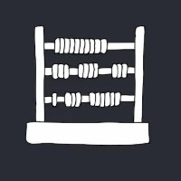
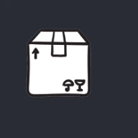
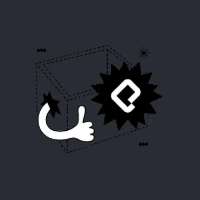
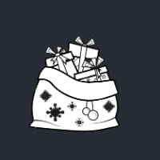

# Adventjs 2021

Realizo los retos de **[Adventjs](https://2021.adventjs.dev/)** (Juego con retos de programación.) creados por [Miguel Ángel Durán _"midudev"_](https://midu.dev).

## Progreso

- Retos completados: 21 de 25

## Changelog

- **18 Dic 2024** - Retos 14 a 21 completados.
- **17 Dic 2024** - Retos 8 a 13 completados.
- **16 Dic 2024** - Retos 1 a 7 completados.

## Soluciones

| #   | Desafío                                                                                   | Dificultad  | Estado |
| --- | ----------------------------------------------------------------------------------------- | ----------- | ------ |
| 01  |  [Contando ovejas para dormir](01/index.js)                        | Fácil       | ✅     |
| 02  |  [¡Ayuda al elfo a listar los regalos!](02/index.js)               | Fácil       | ✅     |
| 03  |  [El Grinch quiere fastidiar la Navidad](03/index.js)              | Normal      | ✅     |
| 04  |  [¡Es hora de poner la navidad en casa!](04/index.js)              | Normal      | ✅     |
| 05  |  [Contando los días para los regalos](05/index.js)                 | Fácil       | ✅     |
| 06  |  [Rematando los exámenes finales](06/index.js)                     | Normal      | ✅     |
| 07  |  [Buscando en el almacén...](07/index.js)                          | Normal      | ✅     |
| 08  |  [La locura de las criptomonedas](08/index.js)                     | Normal      | ✅     |
| 09  |  [Agrupando cosas automáticamente](09/index.js)                    | Difícil     | ✅     |
| 10  |  [La máquina de cambio](10/index.js)                               | Difícil     | ✅     |
| 11  |  [¿Vale la pena la tarjeta fidelidad del cine?](11/index.js)       | Normal      | ✅     |
| 12  |  [La ruta perfecta para dejar los regalos](12/index.js)            | Difícil     | ✅     |
| 13  |  [Envuelve regalos con asteriscos](13/index.js)                    | Fácil       | ✅     |
| 14  |  [En busca del reno perdido](14/index.js)                          | Normal      | ✅     |
| 15  |  [El salto perfecto](15/index.js)                                  | Normal      | ✅     |
| 16  |  [Descifrando los números...](16/index.js)                         | Fácil       | ✅     |
| 17  |  [La locura de enviar paquetes en esta época](17/index.js)         | Difícil     | ✅     |
| 18  |  [El sistema operativo de Santa Claus](18/index.js)                | Fácil       | ✅     |
| 19  |  [¿Qué deberíamos aprender en Platzi?](19/index.js)                | Normal      | ✅     |
| 20  |  [¿Una carta de pangramas? ¡QUÉ!](20/index.js)                     | Fácil       | ✅     |
| 21  |  [La ruta con los regalos](21/index.js)                            | Difícil     | ✅     |
| 22  |  ¿Cuantos adornos necesita el árbol?                               | Normal      | ❌     |
| 23  |  ¿Puedes reconfigurar las fábricas para no parar de crear regalos? | Muy difícil | ❌     |
| 24  |  Comparando árboles de Navidad                                     | Normal      | ❌     |
| 25  |  El último juego y hasta el año que viene 👋                       | Normal      | ❌     |
