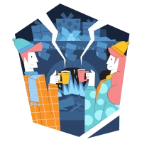

# Adventjs 2022

Realizo los retos de **[Adventjs](https://2021.adventjs.dev/)** (Juego con retos de programación.) creados por [Miguel Ángel Durán _"midudev"_](https://midu.dev).

## Progreso

- Retos completados: 7 de 24

## Changelog

## Soluciones

| #   | Desafío                                                                                  | Dificultad | Estado |
| --- | ---------------------------------------------------------------------------------------- | ---------- | ------ |
| 01  |  [¡Automatizando envolver regalos de navidad!](01/index.js)       | Fácil      | ✅     |
| 02  |  [Nadie quiere hacer horas extra](02/index.js)                    | Fácil      | ✅     |
| 03  |  [¿Cuántas cajas de regalos puede llevar Papá Noel?](03/index.js) | Fácil      | ✅     |
| 04  |  [Una caja dentro de otra caja y otra...](04/index.js)            | Medio      | ✅     |
| 05  |  [Optimizando viajes de Santa](05/index.js)                       | Difícil    | ✅     |
| 06  |  [Creando adornos navideños](06/index.js)                         | Medio      | ✅     |
| 07  |  [Haciendo inventario de regalos](07/index.js)                    | Fácil      | ✅     |
| 08  |  [¡Necesitamos un mecánico!]                                      | Medio      | ❌     |
| 09  |  [Las locas luces de Navidad]                                     | Fácil      | ❌     |
| 10  |  [El salto del trineo de Papá Noel]                               | Medio      | ❌     |
| 11  |  [Papá Noel es Scrum Master]                                      | Difícil    | ❌     |
| 12  |  [Trineos eléctricos, ¡guau!]                                     | Medio      | ❌     |
| 13  |  [Backup de los archivos de Papá Noel]                            | Fácil      | ❌     |
| 14  |  [El mejor camino]                                                | Medio      | ❌     |
| 15  |  [Decorando el árbol de Navidad]                                  | Medio      | ❌     |
| 16  |  [Arreglando las cartas de Papá Noel]                             | Difícil    | ❌     |
| 17  |  [Llevando los regalos en sacos]                                  | Medio      | ❌     |
| 18  |  [¡Nos quedamos sin tinta!]                                       | Fácil      | ❌     |
| 19  |  [Ordenando los regalos]                                          | Fácil      | ❌     |
| 20  |  [Más viajes retadores]                                           | Difícil    | ❌     |
| 21  |  [Creando la tabla de regalos]                                    | Medio      | ❌     |
| 22  |  [La iluminación en sintonía]                                     | Fácil      | ❌     |
| 23  |  [Compilador de Papá Noel]                                        | Difícil    | ❌     |
| 24  |  [El último reto es un laberinto]                                 | Difícil    | ❌     |
