# Adventjs 2024

Realizo los retos de **[Adventjs](https://adventjs.dev/)** (Juego con retos de programación.) creados por [Miguel Ángel Durán _"midudev"_](https://midu.dev).

## Progreso

- Retos completados: 22 de 25

## Changelog

- **22 Dic 2024** - [Reto 22 - 2024](2024/22/index.js) completado.
- **21 Dic 2024** - [Reto 21 - 2024](2024/21/index.js) completado.
- **20 Dic 2024** - [Reto 20 - 2024](2024/20/index.js) completado.
- **19 Dic 2024** - [Reto 19 - 2024](2024/19/index.js) completado.
- **18 Dic 2024** - [Reto 18 - 2024](2024/18/index.js) completado.
- **18 Dic 2024** - [Reto 18 - 2024](2024/18/index.js) completado.
- **17 Dic 2024** - [Reto 17 - 2024](2024/17/index.js) completado.
- **16 Dic 2024** - [Reto 16 - 2024](2024/16/index.js) completado.
- **15 Dic 2024** - [Reto 15 - 2024](2024/15/index.js) completado.
- **14 Dic 2024** - [Reto 14 - 2024](2024/14/index.js) completado.
- **13 Dic 2024** - [Reto 13 - 2024](2024/13/index.js) completado.
- **12 Dic 2024** - [Reto 12 - 2024](2024/12/index.js) completado.
- **11 Dic 2024** - [Reto 11 - 2024](2024/11/index.js) completado.
- **10 Dic 2024** - [Reto 10 - 2024](2024/10/index.js) completado.
- **9 Dic 2024** - [Reto 9 - 2024](2024/09/index.js) completado.
- **8 Dic 2024** - [Reto 8 - 2024](2024/08/index.js) completado.
- **7 Dic 2024** - [Reto 7 - 2024](2024/07/index.js) completado.
- **6 Dic 2024** - [Reto 6 - 2024](2024/06/index.js) completado.
- **5 Dic 2024** - [Reto 5 - 2024](2024/05/index.js) completado.
- **4 Dic 2024** - [Reto 4 - 2024](2024/04/index.js) completado.
- **3 Dic 2024** - [Reto 3 - 2024](2024/03/index.js) completado.
- **2 Dic 2024** - [Reto 2 - 2024](2024/02/index.js) completado.
- **1 Dic 2024** - [Reto 1 - 2024](2024/01/index.js) completado.

## Soluciones

| #   | Desafío                                                                                | Dificultad | Estado | Estrellas                      |
| --- | -------------------------------------------------------------------------------------- | ---------- | ------ | ------------------------------ |
| 01  | 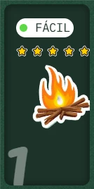 [🎁 ¡Primer regalo repetido!](01/index.js)                     | Fácil      | ✅     | :star::star::star::star::star: |
| 02  | 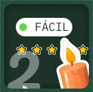 [🖼️ Enmarcando nombres](02/index.js)                           | Fácil      | ✅     | :star::star::star::star::star: |
| 03  | 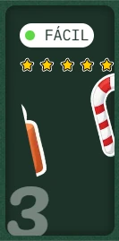 [🏗️ Organizando el inventario](03/index.js)                    | Fácil      | ✅     | :star::star::star::star::star: |
| 04  | 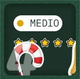 [🎄 Decorando el árbol de Navidad](04/index.js)                | Medio      | ✅     | :star::star::star::star::star: |
| 05  | 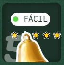 [👞 Emparejando botas](05/index.js)                            | Fácil      | ✅     | :star::star::star::star::star: |
| 06  |  [📦 ¿Regalo dentro de la caja?](06/index.js)                   | Medio      | ✅     | :star::star::star::star::star: |
| 07  |  [👹 El ataque del Grinch](07/index.js)                         | Medio      | ✅     | :star::star::star::star::star: |
| 08  | 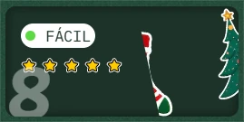 [🦌 La carrera de renos](08/index.js)                          | Fácil      | ✅     | :star::star::star::star::star: |
| 09  | 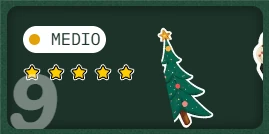 [🚂 El tren mágico](09/index.js)                               | Medio      | ✅     | :star::star::star::star::star: |
| 10  | 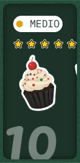 [👩‍💻 El ensamblador élfico](10/index.js)                        | Medio      | ✅     | :star::star::star::star::star: |
| 11  | 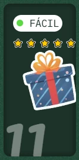 [🏴‍☠️ Nombres de archivos codificados](11/index.js)              | Fácil      | ✅     | :star::star::star::star::star: |
| 12  | 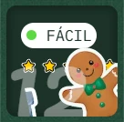 [💵 ¿Cuánto cuesta el árbol?](12/index.js)                     | Fácil      | ✅     | :star::star::star::star::star: |
| 13  | 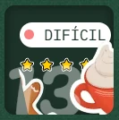 [🤖 ¿El robot está de vuelta?](13/index.js)                    | Difícil    | ✅     | :star::star::star::star::star: |
| 14  | 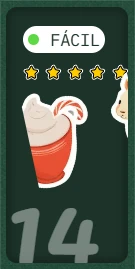 [🦌 Acomodando los renos](14/index.js)                         | Fácil      | ✅     | :star::star::star::star::star: |
| 15  | 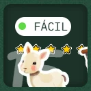 [✏️ Dibujando tablas](15/index.js)                             | Fácil      | ✅     | :star::star::star::star::star: |
| 16  |  [❄️ Limpiando la nieve del camino](16/index.js)                | Fácil      | ✅     | :star::star::star::star::star: |
| 17  |  [💣 Busca las bombas del Grinch](17/index.js)                  | Medio      | ✅     | :star::star::star::star::star: |
| 18  | 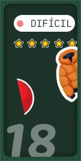 [📇 La agenda mágica de Santa](18/index.js)                    | Difícil    | ✅     | :star::star::star::star::star: |
| 19  | 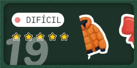 [📦 Apila cajas mágicas para repartir regalos](19/index.js)    | Difícil    | ✅     | :star::star::star::star::star: |
| 20  |  [🎁 Encuentra los regalos faltantes y duplicados](20/index.js) | Fácil      | ✅     | :star::star::star::star::star: |
| 21  | 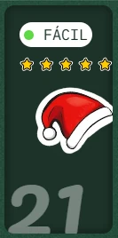 [🎄 Calcula la altura del árbol de Navidad](21/index.js)       | Fácil      | ✅     | :star::star::star::star::star: |
| 22  | 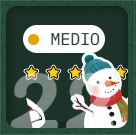 [🎁 Genera combinaciones de regalos](22/index.js)              | Medio      | ✅     | :star::star::star::star::star: |
