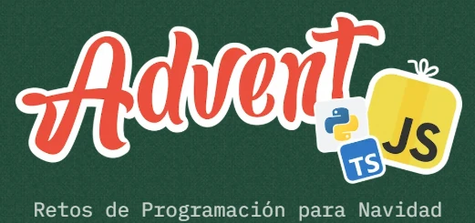

# Adventjs

Realizo los retos de **[Adventjs](https://adventjs.dev/)** (Juego con retos de programación.) creados por [Miguel Ángel Durán _"midudev"_](https://midu.dev).

## Progreso

- ✅ [2024](2024/README.md)
- 2023: 0 de 25
- [2022](2022/README.md): 10 de 24
- ✅ [2021](2021/README.md)

## Changelog

- **05 Jan 2025** - [Retos 9 y 10 - 2022](2022/README.md) completados.
- **04 Jan 2025** - [Reto 8 - 2022](2022/README.md) completado.
- **25 Dic 2024** - [Reto 26 - 2024](2024/26/index.js) completado.
- **25 Dic 2024** - [Reto 25 - 2024](2024/25/index.js) completado.
- **24 Dic 2024** - [Reto 24 - 2024](2024/24/index.js) completado.
- **23 Dic 2024** - [Reto 23 - 2024](2024/23/index.js) completado.
- **22 Dic 2024** - [Reto 22 - 2024](2024/22/index.js) completado.
- **21 Dic 2024** - [Retos 4 a 7 - 2022](2022/README.md) completados.
- **21 Dic 2024** - [Reto 21 - 2024](2024/21/index.js) completado.
- **20 Dic 2024** - [Retos 1 a 3 - 2022](2022/README.md) completados.
- **20 Dic 2024** - [Reto 20 - 2024](2024/20/index.js) completado.
- **19 Dic 2024** - [Reto 19 - 2024](2024/19/index.js) completado.
- **19 Dic 2024** - [Retos 22 a 25 - 2021](2021/README.md) completados.
- **18 Dic 2024** - [Reto 18 - 2024](2024/18/index.js) completado.
- **18 Dic 2024** - [Retos 14 a 21 - 2021](2021/README.md) completados.
- **17 Dic 2024** - [Reto 17 - 2024](2024/17/index.js) completado.
- **17 Dic 2024** - [Retos 8 a 13 - 2021](2021/README.md) completados.
- **16 Dic 2024** - [Reto 16 - 2024](2024/16/index.js) completado.
- **16 Dic 2024** - [Retos 1 a 7 - 2021](2021/README.md) completados.
- **15 Dic 2024** - [Reto 15 - 2024](2024/15/index.js) completado.
- **14 Dic 2024** - [Reto 14 - 2024](2024/14/index.js) completado.
- **13 Dic 2024** - [Reto 13 - 2024](2024/13/index.js) completado.
- **12 Dic 2024** - [Reto 12 - 2024](2024/12/index.js) completado.
- **11 Dic 2024** - [Reto 11 - 2024](2024/11/index.js) completado.
- **10 Dic 2024** - [Reto 10 - 2024](2024/10/index.js) completado.
- **9 Dic 2024** - [Reto 9 - 2024](2024/09/index.js) completado.
- **8 Dic 2024** - [Reto 8 - 2024](2024/08/index.js) completado.
- **7 Dic 2024** - [Reto 7 - 2024](2024/07/index.js) completado.
- **6 Dic 2024** - [Reto 6 - 2024](2024/06/index.js) completado.
- **5 Dic 2024** - [Reto 5 - 2024](2024/05/index.js) completado.
- **4 Dic 2024** - [Reto 4 - 2024](2024/04/index.js) completado.
- **3 Dic 2024** - [Reto 3 - 2024](2024/03/index.js) completado.
- **2 Dic 2024** - [Reto 2 - 2024](2024/02/index.js) completado.
- **1 Dic 2024** - [Reto 1 - 2024](2024/01/index.js) completado.
